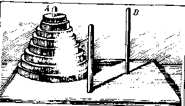

Title: 递归问题
Date: 2013-8-14
Tags: Math

# 热身题

## 题1

## 题2 

###  分析：  
   |n $\qquad$ |0 |1 |2 |
   -------- | --- | ----| -------
    $f(n)$  | 0   | 2   | 8

   设移动n个圆盘需要$f(n)$次。步骤：
  
   1.   将n-1个圆盘移到B，则需$f(n-1)$次；
   2.   将第n个圆盘移到C，则需要1次；
   3.   将n-1个圆盘移到A，则需$f(n-1)$次；
   4.   将第n个圆盘移到B，则需1次；
   5.   将n-1个圆盘移到B，则需$f(n-1)$次。

   则：$f(n)=f(n-1)+1+f(n-1)+1+f(n-1)=3f(n-1)+2$

### 求解：
  $$f(n)+1=f(n-1)+3$$
  设$t(n)=f(n)+1$，那么，$t(n)=3t(n-1)$，则，$t(n)=3^nt(0)$
$$f(n)=3^n-1$$