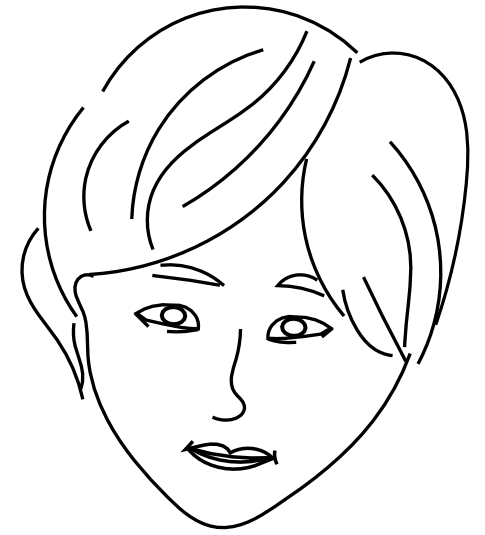
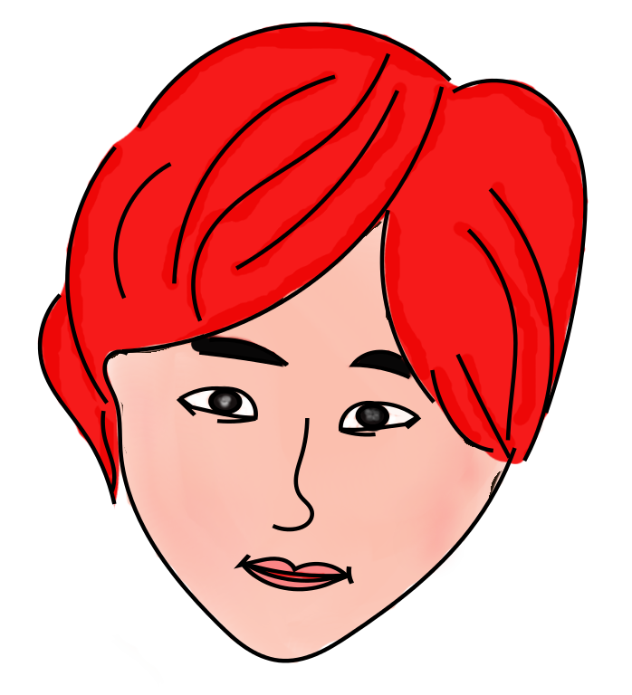

Title: Inkscape 基础
Date: 2013-08-03 8:30
Tags: Inkscape Painting

[TOC]

* * *

* * *

## 快捷键

   * Ctrl+arrow: 平移画布
   * Ctrl+B: 显示/隐藏滚动条
   * -/+: 缩小/放大画布
   * \`/Shift+\`: 回到/恢复缩放比例
   * Ctrl+Tab: 在文档见循环切换
   * Ctrl: 水平或垂直移动/保持宽高比/以15度整数倍旋转
   * F1/Space: 选择工具
   * Ctrl+G/U: 组合/解散群组
   * Ctrl+click: 选择群组中的一个对象
   * Ctrl+D: 复制对象
   * Home/End: 置于顶层/底层
   * PgUp/PgDn: 上移/下移
   * Tab/Shift+Tab: 选择叠放对象
   * Alt+drag: 拖动选择的对象
   * Ctrl+Shift+C: 形状转换为路径

## 规则路径

### 绘制路径

* 单击：创建一个没有曲线控制柄的尖锐点
* 点击后拖动：产生一个光滑的Bezier节点
* Enter: 结束绘制
* Esc: 取消绘制
* Backspace: 取消上一段

### 编辑路径

点击节点工具（F2），选择路径，会出现一些灰色的方形*节点*；通过点击、Shift+点击、或拖出弹性选框，来选择这些节点。

   * 单击路径中的一段来选择相邻的节点
   * \! 键在当前子路径范围内反选节点
   * Alt+\! 在整个路径范围内反选节点
   * 双击添加节点
   * Del 删除节点（保持路径不变）
   * Ctrl+Del 删除节点（保持相邻节点不变）
   * Shift+C 使节点尖锐
   * Shift+S 使节点平滑
   * Shift+Y 使节点对称（两个控制柄共线且等长）
   * Ctrl+click 控制柄，可以将节点的控制柄收回
   * Shift+drag 可以将控制柄重新拉出

### 子路径和结合

* Ctrl+K 形成复合路径
* Shift+Ctrl+K 分解为独立路径

> 由于一个对象只能有一种填充和轮廓样式，结合
后的复合路径将继承第一个对象(处于叠放次序的底层)的属性。在合并有填充的路径时,如果路径之间有重叠区域，合并后，重叠部分的填充将消失（形成中空效果）

   

   
   
   