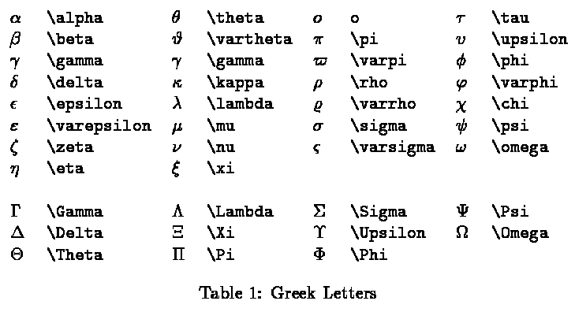

Title: 数学公式
Date: 2013-08-09 18:00
Tags: Math

[TOC]

* * *

## 自相关函数

$$c(k) = \frac{\sum\limits_{i=1}^{N-k}(x_i-\mu)(x_{i+k}-\mu)}{\sum\limits_{i=1}^N(x_i-u)^2} \qquad其中\quad \mu=\frac{1}{N}\sum_{i=1}^{N}x_i$$

## Sigmoid 函数

$$\sigma(z)=\frac{1}{1+e^{-z}}$$

特性：

*  很像阶跃函数